# SMART CONTRACTS #Truffle #OpenZeppelin 

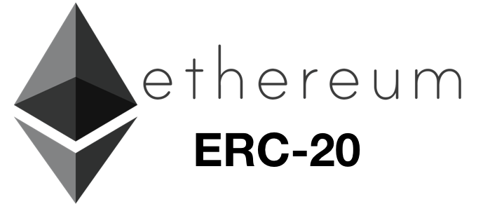

Para esta practica se crearan tokens que cumplan los estandares ERC20. 

Por lo que comenzamos en cmd ubicando la direccion donde crearemos nuestro proyecto y una vez localizados ahi crearemos nuestros archivos basicos del proyecto mediante los comandos: truffle init, npm init, npm install @openzeppelin/contracts

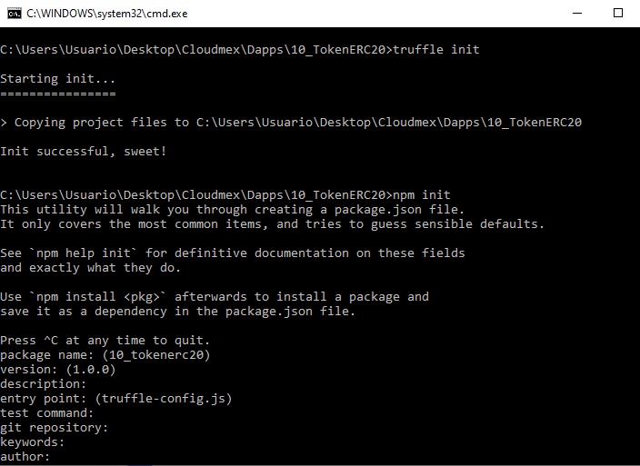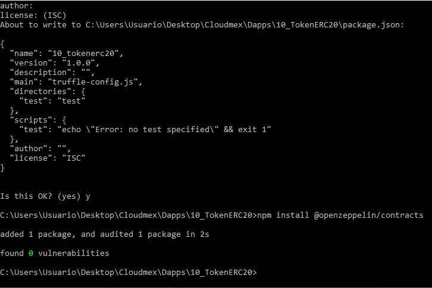

Una vez instalados los archivos, crearemos una carpeta nueva con la ruta de "build/contracts" y en dicha carpeta copiaremos los archivos que se encuentran en "node_modules/@openzeppelin/contracts/build/contracts/"

Ahora pasaremos a iniciar nuestro contrato mediante cmd con el comando "truffle develop" el cual nos generara nuestras cuentas, llaves privadas y nuestro mnemonic.

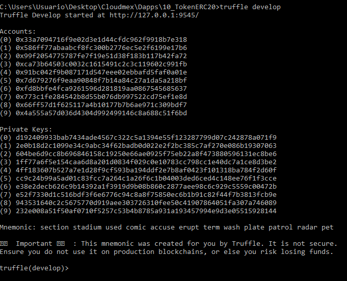

Ya iniciado nuestro contrato, crearemos nuestro token al cual le asignaremos nombre y un simbolo que contendra el nuevo constructor del token al que llamaremos "ERC20PresetMinterPauser".

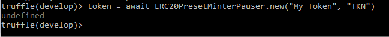

Para interactuar con el token que se acaba de generar, podemos corroborar los datos que contiene en su constructor al mansarlos a llamar como se ve a continuacion:

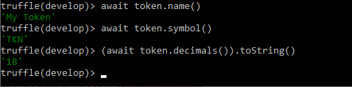

Despues de verificar que el token esta correcto, fondearemos nuestra cuenta, pueden elegir cualquiera de la lista de cuentas que les arrojo previamente. En este ejemplo le fondearemos 1,000 tokens (cada token tiene 18 decimales).

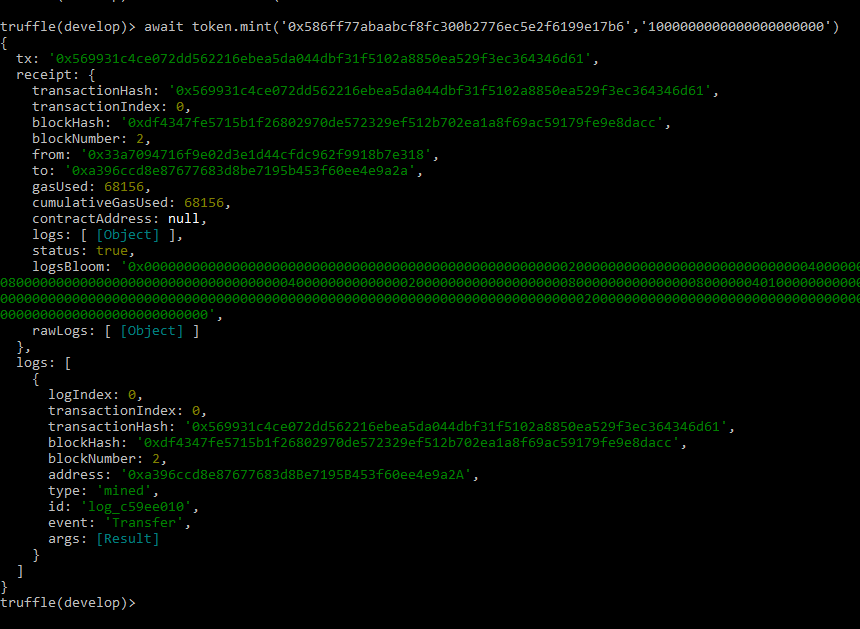

Revisamos que ha sido fondeada correctamente la cuenta

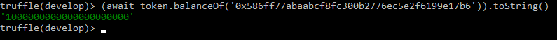

Otra forma de interactuar es quemar fondos de una cuenta, para eso, dentro de la uenta que estamos trabajando usaremos el comando burn en el cual declararemos la cuenta y la cantidad a quemar.

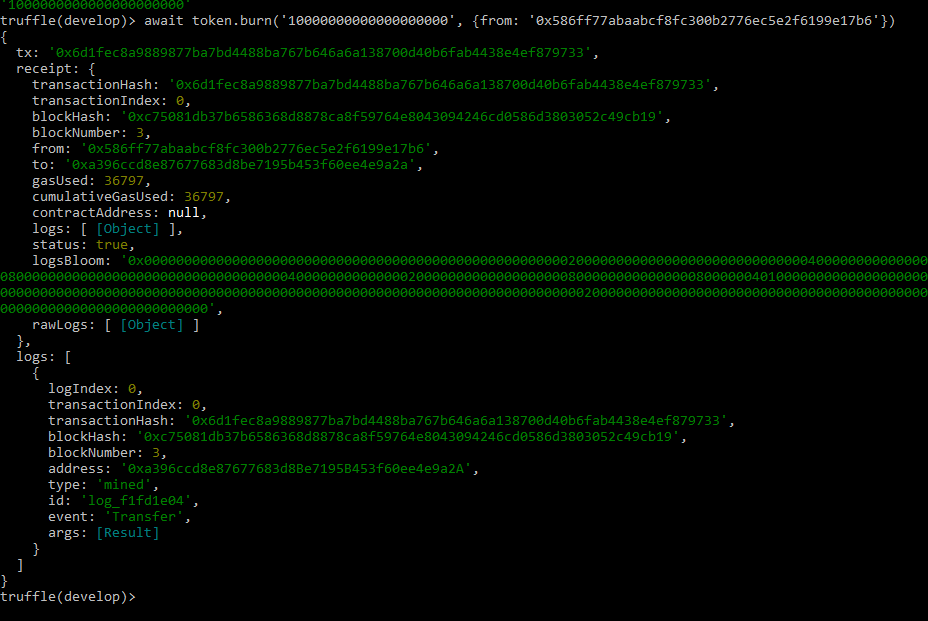

Nuevamente verificamos que se le resto la cantidad que asignamos como se puede ver a continuacion:

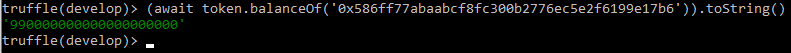

Y por ultimo podemos pausar las transaccioness de una cuenta.

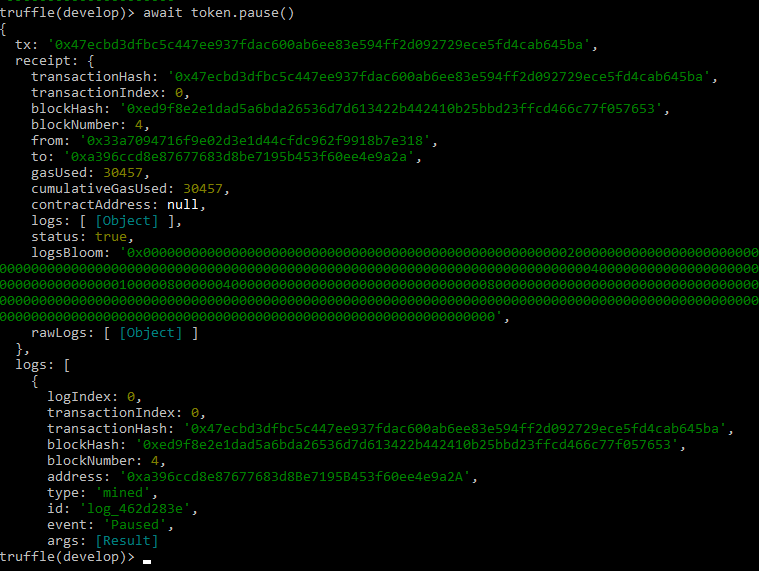

Una vez que se han pausado no se les podra realizar transferencias hasta que se le quite la pausa.

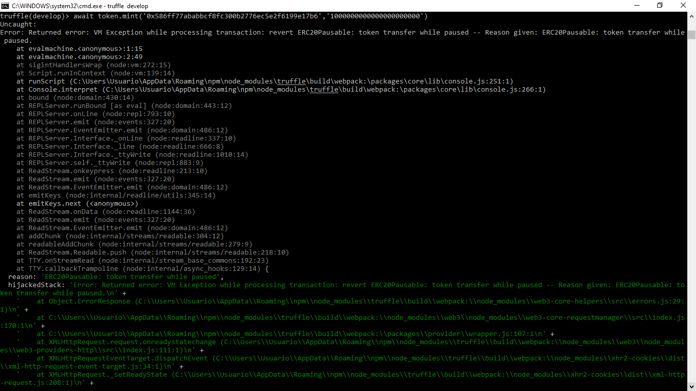

En cuanto a la migracion, crearemos un nuevo archivo en la carpeta "migrations" de nuestro proyecto en el cual crearemos nuestro deploy.js, el cual no es muy complicado ya que solo hace mencion directa a @openzeppeli

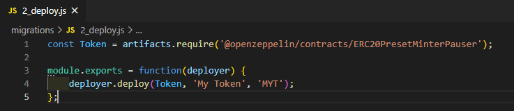

Para ejecutarlo debemos tener nuestro Ganache y una vez este abierto en nuestro cmd escribimos el comando "truffle migrate"

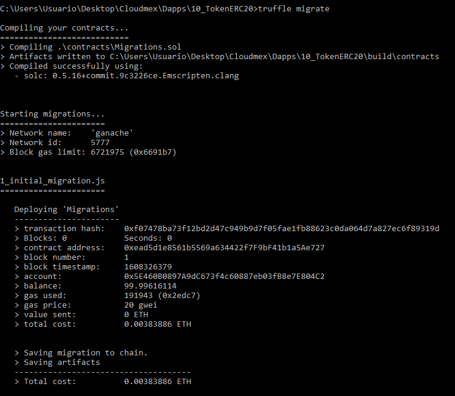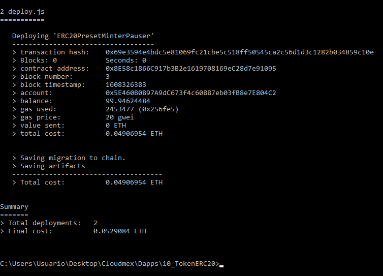

Esto nos compilara, desplegara y migrara nuestro smart contract de nuestro token directamente a ganache, nos muestra la informacion de las transaciones y las cuentas, una vez finalizado, en Ganache podemos observar que se hicieron las transacciones y el cobro correspondiente a la migracion.

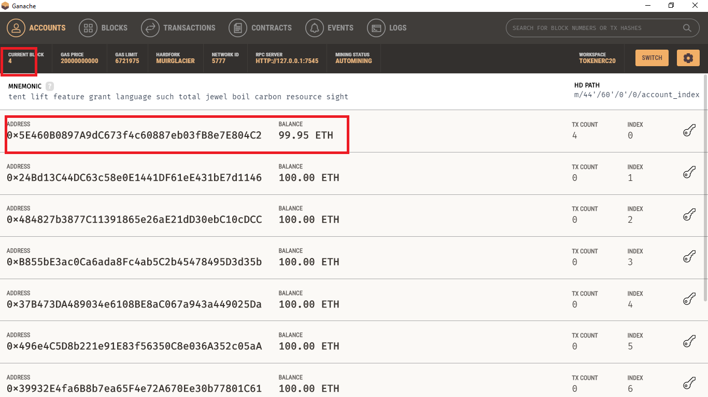

Tutorial original : https://forum.openzeppelin.com/t/create-an-erc20-using-truffle-without-writing-solidity/2713